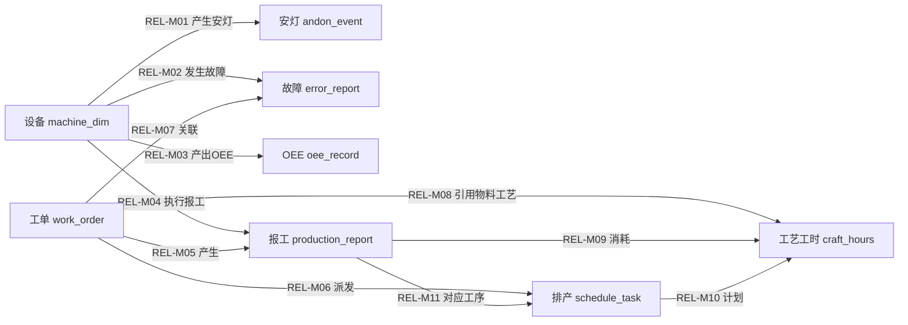

# 语义模型对象关系与 Agent MCP 方案设计

> **版本**：v0.1（草案）
> **日期**：2026-08-03
> **状态**：待评审
> **关联文档**：[[../../项目管理/原型梳理-页面与字段分析|原型梳理-页面与字段分析]]、[[../../产品方案/03-页面原型说明|03-页面原型说明]]、[[../数据同步策略/2026-07-28-sk-mind-semantic-model-design|语义建模设计方案]]、[[../../本体建模/模型/03-关系模型|03-关系模型]]、[[../../本体建模/模型/04-业务关系图谱模型|04-业务关系图谱模型]]

## 一、背景与目标

### 1.1 背景

MES 数据已基本导入 sk-mind 平台：

- 25 个 MES 接口 → raw 层物理表（配置见 `backend/config/data_sources/MES.yaml`）
- 8 个 serving 视图已建立（Alembic 020），完成时间转换、车间映射、班次推断、字段清洗
- YAML 语义模型已落地：8 个业务对象 + 19 个指标（`backend/config/semantic/mes/`）
- Agent MCP 已提供 query_objects / query_metrics 两个查询工具

当前缺口：

- 8 个业务对象之间**没有语义关系定义**（`semantic_relations` 表未建，`data_mappings.semantic_relation_id` 仍为占位）
- 没有实例级关系边（BusinessGraphEdge）
- MCP 缺少关系与图谱查询工具
- 前端「语义关系」Tab 和「关系图谱」页仍是占位（硬编码假数据，且错误复用了 lineage 血缘数据）

### 1.2 目标

| 目标 | 说明 |
|---|---|
| 定义对象关系 | 类型层 SemanticRelation（MES 11 条 + 跨系统预留） |
| 设计关系边 | 实例层 BusinessGraphEdge 表、生成规则与可信度分级 |
| 扩展 Agent MCP | 新增 query_relations / query_graph 两个工具 |
| 完成前端页面 | 「语义模型-语义关系」Tab + 「关系图谱」三个 Tab |

## 二、现状盘点

| 模块 | 现状 | 缺口 |
|---|---|---|
| serving 视图 | 8 个视图（020 迁移） | 无 |
| YAML 语义模型 | 8 对象 + 19 指标 | 无 relations 定义 |
| semantic 模块 | 对象/属性/映射 CRUD | 无 relations CRUD |
| agent 模块 | query_objects / query_metrics / catalog / reload | 无关系/图谱工具 |
| 前端语义模型 | 对象/属性/映射已实现 | 语义关系/行动策略为占位 |
| 前端关系图谱 | 页面骨架 | 使用 lineage 数据顶替，非业务图谱 |

> **说明**：关系图谱页当前 `relation-graph/index.vue` 通过 `lineageService` 读取的是数据血缘边（DataLineage），不是业务对象实例关系。本期必须新建 graph 模块替换，避免两个概念混淆。

## 三、对象关系设计（类型层）

### 3.1 关系类型字典

沿用 [[../../本体建模/模型/03-关系模型|03-关系模型]] 的 8 类字典：

| 关系大类 | 代码 | 含义 |
|---|---|---|
| 结构关系 | structural | 组成、包含、层级、版本替代 |
| 交易关系 | transactional | 购买、销售、供应、结算 |
| 资源关系 | resource | 占用、消耗、产出、调度 |
| 过程关系 | process | 前置、后置、触发、流转 |
| 责任关系 | responsibility | 负责、审批、执行 |
| 财务关系 | financial | 过账、核销、分配、结转 |
| 质量关系 | quality | 检验、判定、不合格 |
| 事件关系 | event | 影响、通知、触发 |

### 3.2 MES 关系清单（11 条）

基于真实 serving 视图可 join 字段定义：

| 编码 | 关系名称 | 主体 → 客体 | 类型 | 基数 | 关联机制 |
|---|---|---|---|---|---|
| REL-M01 | 产生安灯事件 | machine_dim → andon_event | event | 1:N | machine_no |
| REL-M02 | 发生故障上报 | machine_dim → error_report | event | 1:N | machine_no |
| REL-M03 | 产出OEE记录 | machine_dim → oee_record | resource | 1:N | mid / machine_no |
| REL-M04 | 执行生产报工 | machine_dim → production_report | resource | 1:N | machine_no |
| REL-M05 | 产生报工记录 | work_order → production_report | process | 1:N | workorder_no |
| REL-M06 | 派发排产任务 | work_order → schedule_task | process | 1:N | workorder_no |
| REL-M07 | 关联故障上报 | work_order → error_report | event | 1:N | workorder_no |
| REL-M08 | 引用物料工艺 | work_order → craft_hours | resource | N:1 | material_no |
| REL-M09 | 报工消耗物料工艺 | production_report → craft_hours | resource | N:1 | material_no |
| REL-M10 | 排产计划物料工艺 | schedule_task → craft_hours | resource | N:1 | material_no |
| REL-M11 | 报工对应工序任务 | production_report → schedule_task | process | N:1 | workorder_no + procedure_no |

> **注意**：REL-M11 的关联需要 `workorder_no + procedure_no` 双字段 join，`production_report` 与 `schedule_task` 两个 serving 视图均含这两个字段，可精确匹配工序级报工与排产任务。

### 3.3 对象关系图



### 3.4 跨系统关系（Phase 2 预留）

参照 [[../../本体建模/模型/03-关系模型|03-关系模型]] §3.8：

| 编码 | 关系名称 | 主体 | 客体 | 关联机制 |
|---|---|---|---|---|
| REL-X01 | ERP工单映射MES工单 | work_order | ProductionOrder(ERP) | workorder_no = MO.DOC_NO |
| REL-X02 | ERP物料映射MES物料 | craft_hours | Material(ERP) | material_no = ITEM.ITEM_CODE |

> **说明**：跨系统关系依赖 ERP 数据接入后启用，本期不生成实例边，仅预留关系编码。

## 四、数据模型设计

### 4.1 semantic_relations 表（Alembic 022）

```sql
CREATE TABLE semantic_relations (
    id UUID PRIMARY KEY DEFAULT gen_random_uuid(),
    name VARCHAR(200) NOT NULL,
    code VARCHAR(100) NOT NULL UNIQUE,
    relation_type VARCHAR(50) NOT NULL,
    subject_object_id UUID NOT NULL REFERENCES semantic_objects(id) ON DELETE CASCADE,
    object_object_id UUID NOT NULL REFERENCES semantic_objects(id) ON DELETE CASCADE,
    cardinality VARCHAR(10) NOT NULL,
    join_mechanism TEXT,
    description TEXT,
    agent_enabled BOOLEAN NOT NULL DEFAULT TRUE,
    status VARCHAR(20) NOT NULL DEFAULT 'draft',
    created_at TIMESTAMPTZ NOT NULL DEFAULT NOW(),
    updated_at TIMESTAMPTZ NOT NULL DEFAULT NOW()
);
```

> **说明**：`cardinality` 取值 `1:1 / 1:N / N:1 / N:M`；`join_mechanism` 记录 serving 视图间的关联字段，供边生成与 MCP 目录展示使用。

### 4.2 business_graph_edges 表（实例层）

```sql
CREATE TABLE business_graph_edges (
    id UUID PRIMARY KEY DEFAULT gen_random_uuid(),
    relation_id UUID NOT NULL REFERENCES semantic_relations(id) ON DELETE CASCADE,
    from_object_id UUID NOT NULL REFERENCES semantic_objects(id),
    from_entity_id VARCHAR(200) NOT NULL,
    to_object_id UUID NOT NULL REFERENCES semantic_objects(id),
    to_entity_id VARCHAR(200) NOT NULL,
    edge_properties JSONB,
    source_dataset VARCHAR(300),
    generated_by VARCHAR(20) NOT NULL DEFAULT 'system',
    confidence DECIMAL(3,2) NOT NULL DEFAULT 0.90,
    status VARCHAR(20) NOT NULL DEFAULT 'pending',
    confirmed_by VARCHAR(100),
    confirmed_at TIMESTAMPTZ,
    valid_from TIMESTAMPTZ,
    valid_to TIMESTAMPTZ,
    created_at TIMESTAMPTZ NOT NULL DEFAULT NOW(),
    updated_at TIMESTAMPTZ NOT NULL DEFAULT NOW(),
    CONSTRAINT uq_graph_edge
        UNIQUE (relation_id, from_object_id, from_entity_id, to_object_id, to_entity_id)
);
```

> **说明**：`generated_by` 取值 `system / mapping_rule / ai / manual`；`status` 取值 `pending / confirmed / rejected / insufficient`。唯一约束保证幂等 upsert。

### 4.3 YAML relations 定义

新增 `backend/config/semantic/mes/relations.yaml`（示例）：

```yaml
relations:
  - code: REL-M01
    name: 产生安灯事件
    relation_type: event
    subject: machine_dim
    object: andon_event
    cardinality: "1:N"
    join_mechanism: machine_no
    agent_enabled: true
```

`SourceSemanticLoader` 增加 `_load_relations()`，并沿用现有 `sync_to_db()` 模式 upsert 到 `semantic_relations`。

### 4.4 关系边生成规则

| 生成方式 | 默认可信度 | 说明 | Agent 处理 |
|---|---|---|---|
| system | 0.95 | serving 视图 join 直接生成 | 直接使用 |
| mapping_rule | 0.90 | 明确映射规则推导 | 直接使用 |
| ai | 0.60 | AI 推断生成 | 标注低可信，建议核实 |
| manual | 0.90 | 人工创建或确认 | 直接使用 |

生成 SQL 示例（REL-M05 工单 → 报工）：

```sql
INSERT INTO business_graph_edges
    (relation_id, from_object_id, from_entity_id,
     to_object_id, to_entity_id,
     source_dataset, generated_by, confidence, status)
SELECT
    r.id,
    wo.id,   pr.workorder_no,
    pr_oid.id, pr.wtaid::text,
    'serving.reporting_v1', 'system', 0.95, 'pending'
FROM serving.reporting_v1 pr
JOIN semantic_objects wo    ON wo.code = 'mes.work_order'
JOIN semantic_objects pr_oid ON pr_oid.code = 'mes.production_report'
JOIN semantic_relations r   ON r.code = 'REL-M05'
WHERE pr.workorder_no IS NOT NULL
ON CONFLICT ON CONSTRAINT uq_graph_edge DO NOTHING;
```

> **原理**：边生成只做「类级定义 + 视图 join 字段」的实例化，不复制业务数据本身；重复执行靠唯一约束幂等。

## 五、Agent MCP 设计

### 5.1 现有端点

| 端点 | 方法 | 说明 |
|---|---|---|
| /api/agent/query_objects | POST | 对象数据查询 |
| /api/agent/query_metrics | POST | 指标聚合查询 |
| /api/agent/catalog | GET | 对象/指标目录 |
| /api/agent/reload | POST | YAML 热重载 |

### 5.2 新增端点

| 端点 | 方法 | 说明 |
|---|---|---|
| /api/agent/query_relations | POST | 查询语义关系定义（含关联字段） |
| /api/agent/query_graph | POST | 查询实例关系边/路径（跳数、可信度、仅已确认过滤） |

`query_relations` 请求与响应：

```json
{
  "source": "mes",
  "relationType": "event",
  "subjectObject": "machine_dim",
  "agentEnabledOnly": true
}
```

```json
{
  "code": 0,
  "relations": [
    {
      "code": "REL-M01",
      "name": "产生安灯事件",
      "relationType": "event",
      "subjectObject": "machine_dim",
      "objectObject": "andon_event",
      "cardinality": "1:N",
      "joinMechanism": "machine_no",
      "agentEnabled": true
    }
  ]
}
```

`query_graph` 请求与响应：

```json
{
  "source": "mes",
  "objectType": "work_order",
  "entityId": "WO001",
  "relationCode": "REL-M05",
  "hops": 2,
  "minConfidence": 0.7,
  "confirmedOnly": true
}
```

```json
{
  "paths": [
    {
      "edges": [
        {
          "fromType": "work_order",
          "fromId": "WO001",
          "relationCode": "REL-M05",
          "relationName": "产生报工记录",
          "toType": "production_report",
          "toId": "12345",
          "confidence": 0.95,
          "status": "confirmed"
        }
      ]
    }
  ]
}
```

### 5.3 mes-agent 侧配置更新

`G:/workspace/GD-SaiiKen/agent/mes-agent/agent/agent.yaml` 的 `mcp_server.tools` 增加：

```yaml
tools:
  - "query_objects"
  - "query_metrics"
  - "query_relations"
  - "query_graph"
```

`agent/tools/mcp-tools.json` 同步增加两个工具定义，并在 `available_relations` 中登记 REL-M01 至 REL-M11。

> **注意**：mes-agent 位于独立仓库，配置变更需在联调阶段与 sk-mind 同步发布。

## 六、前端页面设计

### 6.1 语义模型页 — 语义关系 Tab

对齐 [[../../项目管理/原型梳理-页面与字段分析|原型梳理-页面与字段分析]] §八「语义关系」。

列表列分组：

- 基础：关系名称、关系编码
- 对象：主体对象、客体对象
- 语义：关系方向（基数）、关系类型
- 状态：Agent可用、图谱边数、状态
- 操作：编辑 / 生成边 / 查看边

页面交互：

| 操作 | 说明 |
|---|---|
| 创建关系 | 弹窗：名称、编码、类型、主体对象、客体对象、基数、关联字段、描述 |
| 生成边 | 调用 `POST /graph/edges/generate?relationCode=REL-M01`，返回生成数量 |
| 查看边 | 跳转关系图谱页并按 relation 过滤 |
| 编辑 | 修改类型、基数、关联字段、Agent可用等 |

### 6.2 关系图谱页

对齐 §九「关系图谱」三个 Tab。

**关系边列表**列分组：

- 起点：起点对象 + 起点 ID
- 关系：关系名称
- 终点：终点对象 + 终点 ID
- 溯源：来源（serving 视图）、生成方式
- 可信度与状态：可信度、确认状态
- 操作：查看 / 确认 / 拒绝

**关系查询**表单：

| 字段 | 说明 |
|---|---|
| 对象类型 | 下拉，8 个业务对象 |
| 对象 ID | 选填，不填则查该类型全部 |
| 关系类型 | 下拉，任意 / REL-M01 至 REL-M11 |
| 跳数范围 | 1 / 2 / 3 |
| 可信度范围 | 默认 0.7 ～ 1.0 |
| 仅已确认关系 | 开关，默认开启 |

结果按跳数分组展示路径卡片，每段显示 起点 → 关系 → 终点 + 可信度 + 确认状态。

**待确认关系**：

- 卡片列表：起点 → 关系 → 终点 + 来源 + 生成方式 + 可信度 + 证据说明
- 操作：确认关系 / 拒绝 / 标记信息不足

> **核心原则**：AI 或规则生成的关系默认 `pending`，必须经人工确认后才可被 Agent 高可信使用。

### 6.3 页面与后端对接

| 前端功能 | 后端端点 |
|---|---|
| 关系 CRUD | /semantic/relations CRUD |
| 生成边 | POST /graph/edges/generate |
| 边列表/详情 | GET /graph/edges |
| 边确认/拒绝 | POST /graph/edges/{id}/confirm / reject |
| 路径查询 | GET /graph/query 或 /api/agent/query_graph |
| 图谱统计 | GET /graph/stats |

## 七、实施阶段

| 阶段 | 内容 | 产出 |
|---|---|---|
| 1 | Alembic 022：semantic_relations + business_graph_edges | 迁移脚本 |
| 2 | YAML relations 定义 + loader 扩展 | relations.yaml + loader 支持 |
| 3 | semantic relations CRUD + graph 模块（边生成/查询/确认） | 后端 API |
| 4 | Agent MCP：query_relations / query_graph | MCP 工具 |
| 5 | 前端语义关系 Tab + 关系图谱页 | 页面改造 |
| 6 | mes-agent 配置同步 + 联调 | agent.yaml / mcp-tools.json |

> **实施状态（2026-08-03）**：
> - 阶段 1 ✅：`022_create_relation_and_graph_tables.py` 已建两张表
> - 阶段 2 ✅：`relations.yaml`（11 条 REL-M01~M11）+ loader `_load_relations` / `_sync_relations`
> - 阶段 3 ✅：`/api/semantic/relations` CRUD + `/api/graph/*`（generate / edges / confirm / reject / insufficient / stats / query）
> - 阶段 4 ✅：`/api/agent/query_relations` + `/api/agent/query_graph`
> - 阶段 5 ✅：前端「语义关系」Tab 真实 CRUD + 「关系图谱」三 Tab 换用 graph API（`semantic-model/index.vue` / `relation-graph/index.vue`，vue-tsc + vite build 通过）
> - 阶段 6 ✅：mes-agent 配置同步（`agent.yaml` / `mcp-tools.json` / `system-prompt.md` 三个文件工具清单一致，11 条关系目录已登记）

## 八、验收标准

1. 语义模型页可维护 11 条 MES 关系，主体/客体对象必须存在且校验通过
2. 生成边后关系图谱页可看到实例边，可信度与生成方式正确
3. Agent 可通过 query_relations 获取关系定义，通过 query_graph 查询 1-3 跳路径，支持可信度与「仅已确认」过滤
4. 关系图谱页不再使用 lineage 数据；待确认关系可确认/拒绝/标记信息不足
5. 所有新 API 带权限校验与审计日志

## 九、风险与注意事项

| 风险 | 说明 | 应对 |
|---|---|---|
| 机台号全半角 | 存在 `~` 与 `～` 两种变体 | join 前统一 REPLACE |
| andon 产品/模具字段为 NULL | v2 占位，未从 JSONB 提取 | 相关关系延后定义 |
| workorder.workshop 为 NULL | 工单视图无 machine 字段 | 通过报工/排产间接关联车间 |
| lineage 与业务图谱混淆 | 前端错误复用血缘数据 | 新建 graph 模块，前端改用新接口 |
| 边数据量大 | 全量 join 可能生成大量边 | 分批生成 + 唯一约束 + 幂等 upsert |

> **下一步**：评审通过后按第七章阶段拆分实施，前端页面改造以本设计第六章与 [[../../项目管理/原型梳理-页面与字段分析|原型梳理文档]] §八/§九 为准。
