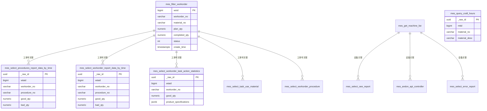

# MES Raw 层表结构设计

> **说明**：基于 [[MES接口梳理-按接口]] 的 25 个接口梳理结果，每个 API 查询接口独立对应一张 Raw 层表，不做合并、不做处理。
> **设计原则**：
> - **一接口一表**：Raw 层不做任何处理，每个 endpoint 的数据独立落一张表，即使两个接口返回一模一样的字段结构也不合并。
> - **原样快照**：API 返回的平级字段 → 物理列，嵌套数组/对象 → 统一 JSONB 存储。结构化展开留给 Clean 层。
> - **不需要 nullable 兼容**：每张表只用该接口自身的响应字段，不混入其他接口字段。
> **状态**：定稿，一接口一表。

---

## 一、设计原则

**核心规则：一个 API 接口 = 一张 Raw 表。**

| 规则 | 说明 |
|---|---|
| 一接口一表 | 每个 API endpoint 的数据独立落一张表，零合并 |
| 平级字段 → 物理列 | 标量值展开为列 |
| 嵌套数组/对象 → JSONB | 不做拆分，原样存储 |
| 只用自有字段 | 每张表仅包含该接口返回的字段，不包含其他接口字段 |
| tracking columns | 每张表统一 8 列通用元数据 |

理由：
- Raw 层职责是原样快照，不做任何结构性变换。
- 零合并意味着后续 API 字段变更时，只影响对应的那一张表。
- Clean 层负责跨表关联、字段合并、数据治理。
- 同步引擎只需一套逻辑：遍历 JSON key，值是标量 → 写列，值是数组/对象 → JSONB。

**表命名规则**：接口 camelCase 名称转 snake_case，前缀 `raw.mes_`。如：
- `filterWorkorder` → `raw.mes_filter_workorder`
- `selectComplishReport` → `raw.mes_select_complish_report`

---

## 二、表关系概览



---

## 三、表定义 DDL

每张表的标准 tracking 列：

```sql
_raw_id             UUID PRIMARY KEY DEFAULT gen_random_uuid(),
_source_id          UUID NOT NULL,
_batch_id           UUID NOT NULL,
_pulled_at          TIMESTAMP NOT NULL,
_source_signature   TEXT,
_row_hash           TEXT,
_quality_flags      JSONB DEFAULT '[]',
_ingested_at        TIMESTAMP DEFAULT now()
```

以下 DDL 中，为节省篇幅，tracking columns 使用缩略形式标注，实际建表时完整写出。

---

### 3.1 `raw.mes_filter_workorder` — 工单查询

> **来源**: filterWorkorder（接口 #1）
> **嵌套**: `simpleProcedureVOS[]` → `simple_procedures` JSONB, `customFields[]` → `custom_fields` JSONB

```sql
CREATE TABLE raw.mes_filter_workorder (
    _raw_id             UUID PRIMARY KEY DEFAULT gen_random_uuid(),
    _source_id          UUID NOT NULL,
    _batch_id           UUID NOT NULL,
    _pulled_at          TIMESTAMP NOT NULL,
    _source_signature   TEXT,
    _row_hash           TEXT,
    _quality_flags      JSONB DEFAULT '[]',
    _ingested_at        TIMESTAMP DEFAULT now(),

    woid                BIGINT NOT NULL,
    workorder_no        VARCHAR(64),
    workorder_type      VARCHAR(32),
    urgent_level        INTEGER,
    mtid                BIGINT,
    material_no         VARCHAR(64),
    material_desc       VARCHAR(256),
    material_spec       VARCHAR(256),
    unit                VARCHAR(16),
    rid                 BIGINT,
    plan_qty            NUMERIC,
    completed_qty       NUMERIC,
    surplus_qty         NUMERIC,
    order_qty           NUMERIC,
    portion_qty         NUMERIC,
    arranged_qty        NUMERIC,
    progress            VARCHAR(32),
    complete_progress   NUMERIC,
    create_time         TIMESTAMPTZ,
    start_time          TIMESTAMPTZ,
    end_time            TIMESTAMPTZ,
    require_end_time    TIMESTAMPTZ,
    estimated_start_time TIMESTAMPTZ,
    estimated_end_time  TIMESTAMPTZ,
    actual_complete_time TIMESTAMPTZ,
    close_time          TIMESTAMPTZ,
    customer_no         VARCHAR(32),
    customization_no    VARCHAR(64),
    customer_requirement TEXT,
    customer_material_code VARCHAR(64),
    customer_material_name VARCHAR(128),
    sales               VARCHAR(64),
    salesorder_no       VARCHAR(64),
    plan_follow_word_no VARCHAR(64),
    order_master        VARCHAR(64),
    project_number      VARCHAR(64),
    order_number        VARCHAR(64),
    current_procedure   VARCHAR(128),
    next_procedure      VARCHAR(128),
    all_procedure       TEXT,
    routings_material_no VARCHAR(64),
    status              INTEGER,
    material_status     INTEGER,
    create_tuid         BIGINT,
    create_user_name    VARCHAR(64),
    close_uid           BIGINT,
    close_user_name     VARCHAR(64),
    material_price      NUMERIC,
    material_total_price NUMERIC,
    standard_work_hours NUMERIC,
    error_info          TEXT,
    notes               TEXT,
    remark              TEXT,
    close_remark        TEXT,
    overdue_count       BIGINT,
    print_number        INTEGER,
    material_ledger_desc VARCHAR(256),
    material_ledger_spec VARCHAR(256),
    supplier            VARCHAR(128),

    simple_procedures   JSONB,
    custom_fields       JSONB
);

CREATE INDEX idx_mfwo_woid      ON raw.mes_filter_workorder (woid);
CREATE INDEX idx_mfwo_no        ON raw.mes_filter_workorder (workorder_no);
CREATE INDEX idx_mfwo_material  ON raw.mes_filter_workorder (material_no);
CREATE INDEX idx_mfwo_customer  ON raw.mes_filter_workorder (customer_no);
CREATE INDEX idx_mfwo_status    ON raw.mes_filter_workorder (status);
CREATE INDEX idx_mfwo_ctime     ON raw.mes_filter_workorder (create_time);
CREATE UNIQUE INDEX uq_mfwo_dedup ON raw.mes_filter_workorder (_batch_id, _row_hash);
```

---

### 3.2 `raw.mes_select_complish_report` — 达成率报表

> **来源**: selectComplishReport（接口 #2）
> **说明**: 全平级字段，无嵌套。

```sql
CREATE TABLE raw.mes_select_complish_report (
    _raw_id             UUID PRIMARY KEY DEFAULT gen_random_uuid(),
    _source_id          UUID NOT NULL,
    _batch_id           UUID NOT NULL,
    _pulled_at          TIMESTAMP NOT NULL,
    _source_signature   TEXT,
    _row_hash           TEXT,
    _quality_flags      JSONB DEFAULT '[]',
    _ingested_at        TIMESTAMP DEFAULT now(),

    sid                 BIGINT,
    shift_name          VARCHAR(64),
    work_date           DATE,
    department_name     VARCHAR(128),
    task_count          INTEGER,
    completed_task_count INTEGER,
    un_completed_task_count INTEGER,
    task_qty            NUMERIC,
    completed_task_qty  NUMERIC,
    un_completed_task_qty NUMERIC,
    complete_rate       NUMERIC,
    qty_complete_rate   NUMERIC
);

CREATE INDEX idx_mscr_date ON raw.mes_select_complish_report (work_date);
CREATE UNIQUE INDEX uq_mscr_dedup ON raw.mes_select_complish_report (_batch_id, _row_hash);
```

---

### 3.3 `raw.mes_select_procedures_report_data_by_time` — 工序报工结果

> **来源**: selectProceduresReportDataByTime（接口 #3）
> **说明**: 全平级字段，无嵌套。仅使用该接口自身返回字段。

```sql
CREATE TABLE raw.mes_select_procedures_report_data_by_time (
    _raw_id             UUID PRIMARY KEY DEFAULT gen_random_uuid(),
    _source_id          UUID NOT NULL,
    _batch_id           UUID NOT NULL,
    _pulled_at          TIMESTAMP NOT NULL,
    _source_signature   TEXT,
    _row_hash           TEXT,
    _quality_flags      JSONB DEFAULT '[]',
    _ingested_at        TIMESTAMP DEFAULT now(),

    woid                BIGINT,
    workorder_no        VARCHAR(64),
    workorder_type      VARCHAR(32),
    salesorder_no       VARCHAR(64),
    plan_follow_word_no VARCHAR(64),
    material_no         VARCHAR(64),
    material_desc       VARCHAR(256),
    material_spec       VARCHAR(256),
    material_code       VARCHAR(64),
    unit                VARCHAR(16),
    wtaid               BIGINT,
    tid                 BIGINT,
    procedure_no        VARCHAR(32),
    procedure_order     INTEGER,
    procedure_name      VARCHAR(128),
    procedure_remark    TEXT,
    good_qty            NUMERIC,
    bad_qty             NUMERIC,
    bad_qty_manufacturing NUMERIC,
    bad_qty_incoming    NUMERIC,
    in_stock_qty        NUMERIC,
    workorder_plan_qty  NUMERIC,
    plan_qty            NUMERIC,
    single_trip_qty     NUMERIC,
    actual_time         NUMERIC,
    earned_hours        NUMERIC,
    single_trip_time    NUMERIC,
    frequency_size      INTEGER,
    machine_no          VARCHAR(64),
    machine_name        VARCHAR(128),
    workcenter_no       VARCHAR(64),
    workcenter_name     VARCHAR(128),
    workshop_name       VARCHAR(128),
    product_line        VARCHAR(128),
    mould_no            VARCHAR(64),
    mould_name          VARCHAR(128),
    user_names          VARCHAR(512),
    employee_nos        VARCHAR(256),
    approver_name       VARCHAR(64),
    one_level_reason    VARCHAR(256),
    two_level_reason    VARCHAR(256),
    three_level_reason  VARCHAR(256),
    approver_time       TIMESTAMPTZ,
    task_start_time     TIMESTAMPTZ,
    task_end_time       TIMESTAMPTZ,
    work_date           DATE,
    create_time         TIMESTAMPTZ,
    warehouse           VARCHAR(128),
    production_batch_no VARCHAR(64),
    material_batch_no   VARCHAR(64),
    material_qty        NUMERIC,
    weight              NUMERIC,
    material_unit       VARCHAR(16),
    knife_weight        NUMERIC,
    material_weight     NUMERIC,
    piece_weight        NUMERIC,
    scrap_weight        NUMERIC,
    task_action_remark  TEXT,
    transfer_card_no    VARCHAR(64),
    component           VARCHAR(128),
    shift_name          VARCHAR(64),
    note                TEXT,
    completion_stage    INTEGER,
    chassis_no          VARCHAR(64),
    rear_outrigger_code VARCHAR(64)
);

CREATE INDEX idx_msprd_woid     ON raw.mes_select_procedures_report_data_by_time (woid);
CREATE INDEX idx_msprd_wno      ON raw.mes_select_procedures_report_data_by_time (workorder_no);
CREATE INDEX idx_msprd_pno      ON raw.mes_select_procedures_report_data_by_time (procedure_no);
CREATE UNIQUE INDEX uq_msprd_dedup ON raw.mes_select_procedures_report_data_by_time (_batch_id, _row_hash);
```

---

### 3.4 `raw.mes_select_production_back_params_by_time` — 工序排产结果

> **来源**: selectProductionBackParamsByTime（接口 #4）
> **嵌套**: `productionBackWorkcenters[]` → `production_back_workcenters` JSONB

```sql
CREATE TABLE raw.mes_select_production_back_params_by_time (
    _raw_id             UUID PRIMARY KEY DEFAULT gen_random_uuid(),
    _source_id          UUID NOT NULL,
    _batch_id           UUID NOT NULL,
    _pulled_at          TIMESTAMP NOT NULL,
    _source_signature   TEXT,
    _row_hash           TEXT,
    _quality_flags      JSONB DEFAULT '[]',
    _ingested_at        TIMESTAMP DEFAULT now(),

    wopid               VARCHAR(64) NOT NULL,
    workorder_no        VARCHAR(64),
    salesorder_no       VARCHAR(64),
    material_no         VARCHAR(64),
    material_desc       VARCHAR(256),
    material_spec       VARCHAR(256),
    procedure_no        VARCHAR(32),
    procedure_name      VARCHAR(128),
    plan_follow_word_no VARCHAR(64),
    plan_qty            NUMERIC,
    pending_qty         NUMERIC,
    arranged_qty        NUMERIC,
    completed_qty       NUMERIC,
    procedure_order     INTEGER,
    completion_stage    INTEGER,

    production_back_workcenters JSONB
);

CREATE INDEX idx_mspbp_wopid    ON raw.mes_select_production_back_params_by_time (wopid);
CREATE INDEX idx_mspbp_wno      ON raw.mes_select_production_back_params_by_time (workorder_no);
CREATE UNIQUE INDEX uq_mspbp_dedup ON raw.mes_select_production_back_params_by_time (_batch_id, _row_hash);
```

---

### 3.5 `raw.mes_select_task_use_material` — 投料明细

> **来源**: selectTaskUseMaterial（接口 #5）
> **嵌套**: `urls[]` → `urls` JSONB

```sql
CREATE TABLE raw.mes_select_task_use_material (
    _raw_id             UUID PRIMARY KEY DEFAULT gen_random_uuid(),
    _source_id          UUID NOT NULL,
    _batch_id           UUID NOT NULL,
    _pulled_at          TIMESTAMP NOT NULL,
    _source_signature   TEXT,
    _row_hash           TEXT,
    _quality_flags      JSONB DEFAULT '[]',
    _ingested_at        TIMESTAMP DEFAULT now(),

    workorder_no        VARCHAR(64),
    task_no             VARCHAR(64),
    did                 BIGINT,
    work_shop           VARCHAR(128),
    product_line        VARCHAR(128),
    wcid                BIGINT,
    workcenter_no       VARCHAR(64),
    workcenter_name     VARCHAR(128),
    procedure_no        VARCHAR(32),
    procedure_name      VARCHAR(128),
    use_material        VARCHAR(64),
    use_material_desc   VARCHAR(256),
    material_batch_no   VARCHAR(64),
    use_qty             NUMERIC,
    use_unit            VARCHAR(16),
    quantity            NUMERIC,
    use_time            TIMESTAMPTZ,
    uid                 BIGINT,
    user_name           VARCHAR(64),
    url_str             TEXT,

    urls                JSONB
);

CREATE INDEX idx_mstum_wno      ON raw.mes_select_task_use_material (workorder_no);
CREATE INDEX idx_mstum_material ON raw.mes_select_task_use_material (use_material);
CREATE UNIQUE INDEX uq_mstum_dedup ON raw.mes_select_task_use_material (_batch_id, _row_hash);
```

---

### 3.6 `raw.mes_select_workorder_procedure` — 工序任务查询

> **来源**: selectWorkorderProcedure（接口 #6）
> **说明**: 全平级字段，无嵌套。**25 表方案新增**。

```sql
CREATE TABLE raw.mes_select_workorder_procedure (
    _raw_id             UUID PRIMARY KEY DEFAULT gen_random_uuid(),
    _source_id          UUID NOT NULL,
    _batch_id           UUID NOT NULL,
    _pulled_at          TIMESTAMP NOT NULL,
    _source_signature   TEXT,
    _row_hash           TEXT,
    _quality_flags      JSONB DEFAULT '[]',
    _ingested_at        TIMESTAMP DEFAULT now(),

    wopid               BIGINT NOT NULL,
    workorder_no        VARCHAR(64),
    salesorder_no       VARCHAR(64),
    material_no         VARCHAR(64),
    material_desc       VARCHAR(256),
    material_spec       VARCHAR(256),
    plan_follow_word_no VARCHAR(64),
    procedure_no        VARCHAR(32),
    procedure_name      VARCHAR(128),
    plan_qty            NUMERIC,
    pending_qty         NUMERIC,
    arranged_qty        NUMERIC,
    completed_qty       NUMERIC
);

CREATE INDEX idx_mswp_wopid ON raw.mes_select_workorder_procedure (wopid);
CREATE INDEX idx_mswp_wno   ON raw.mes_select_workorder_procedure (workorder_no);
CREATE UNIQUE INDEX uq_mswp_dedup ON raw.mes_select_workorder_procedure (_batch_id, _row_hash);
```

---

### 3.7 `raw.mes_select_workorder_report_data_by_time` — 工单报工结果

> **来源**: selectWorkorderReportDataByTime（接口 #7）
> **说明**: 全平级字段，无嵌套。仅使用该接口自身返回字段。与接口 #3 字段结构相同但独立建表。

```sql
CREATE TABLE raw.mes_select_workorder_report_data_by_time (
    _raw_id             UUID PRIMARY KEY DEFAULT gen_random_uuid(),
    _source_id          UUID NOT NULL,
    _batch_id           UUID NOT NULL,
    _pulled_at          TIMESTAMP NOT NULL,
    _source_signature   TEXT,
    _row_hash           TEXT,
    _quality_flags      JSONB DEFAULT '[]',
    _ingested_at        TIMESTAMP DEFAULT now(),

    woid                BIGINT,
    workorder_no        VARCHAR(64),
    workorder_type      VARCHAR(32),
    salesorder_no       VARCHAR(64),
    plan_follow_word_no VARCHAR(64),
    material_no         VARCHAR(64),
    material_desc       VARCHAR(256),
    material_spec       VARCHAR(256),
    material_code       VARCHAR(64),
    unit                VARCHAR(16),
    wtaid               BIGINT,
    tid                 BIGINT,
    procedure_no        VARCHAR(32),
    procedure_order     INTEGER,
    procedure_name      VARCHAR(128),
    procedure_remark    TEXT,
    good_qty            NUMERIC,
    bad_qty             NUMERIC,
    bad_qty_manufacturing NUMERIC,
    bad_qty_incoming    NUMERIC,
    in_stock_qty        NUMERIC,
    workorder_plan_qty  NUMERIC,
    plan_qty            NUMERIC,
    single_trip_qty     NUMERIC,
    actual_time         NUMERIC,
    earned_hours        NUMERIC,
    single_trip_time    NUMERIC,
    frequency_size      INTEGER,
    machine_no          VARCHAR(64),
    machine_name        VARCHAR(128),
    workcenter_no       VARCHAR(64),
    workcenter_name     VARCHAR(128),
    workshop_name       VARCHAR(128),
    product_line        VARCHAR(128),
    mould_no            VARCHAR(64),
    mould_name          VARCHAR(128),
    user_names          VARCHAR(512),
    employee_nos        VARCHAR(256),
    approver_name       VARCHAR(64),
    one_level_reason    VARCHAR(256),
    two_level_reason    VARCHAR(256),
    three_level_reason  VARCHAR(256),
    approver_time       TIMESTAMPTZ,
    task_start_time     TIMESTAMPTZ,
    task_end_time       TIMESTAMPTZ,
    work_date           DATE,
    create_time         TIMESTAMPTZ,
    warehouse           VARCHAR(128),
    production_batch_no VARCHAR(64),
    material_batch_no   VARCHAR(64),
    material_qty        NUMERIC,
    weight              NUMERIC,
    material_unit       VARCHAR(16),
    knife_weight        NUMERIC,
    material_weight     NUMERIC,
    piece_weight        NUMERIC,
    scrap_weight        NUMERIC,
    task_action_remark  TEXT,
    transfer_card_no    VARCHAR(64),
    component           VARCHAR(128),
    shift_name          VARCHAR(64),
    note                TEXT,
    completion_stage    INTEGER,
    chassis_no          VARCHAR(64),
    rear_outrigger_code VARCHAR(64)
);

CREATE INDEX idx_mswrd_woid     ON raw.mes_select_workorder_report_data_by_time (woid);
CREATE INDEX idx_mswrd_wno      ON raw.mes_select_workorder_report_data_by_time (workorder_no);
CREATE INDEX idx_mswrd_pno      ON raw.mes_select_workorder_report_data_by_time (procedure_no);
CREATE UNIQUE INDEX uq_mswrd_dedup ON raw.mes_select_workorder_report_data_by_time (_batch_id, _row_hash);
```

---

### 3.8 `raw.mes_select_workorder_task_action_statistics` — 报工明细

> **来源**: selectWorkorderTaskActionStatistics（接口 #8）
> **嵌套**: `productSpecificationQtyVOS[]` → `product_specifications` JSONB

```sql
CREATE TABLE raw.mes_select_workorder_task_action_statistics (
    _raw_id             UUID PRIMARY KEY DEFAULT gen_random_uuid(),
    _source_id          UUID NOT NULL,
    _batch_id           UUID NOT NULL,
    _pulled_at          TIMESTAMP NOT NULL,
    _source_signature   TEXT,
    _row_hash           TEXT,
    _quality_flags      JSONB DEFAULT '[]',
    _ingested_at        TIMESTAMP DEFAULT now(),

    wtaid               BIGINT NOT NULL,
    wtid                BIGINT,
    woid                BIGINT,
    sid                 BIGINT,
    workorder_no        VARCHAR(64),
    workorder_type      VARCHAR(32),
    task_no             VARCHAR(64),
    rpid                BIGINT,
    procedure_no        VARCHAR(32),
    procedure_name      VARCHAR(128),
    procedure_remark    TEXT,
    mtid                BIGINT,
    material_no         VARCHAR(64),
    material_desc       VARCHAR(256),
    material_spec       VARCHAR(256),
    unit                VARCHAR(16),
    routings_material_no VARCHAR(64),
    mid                 BIGINT,
    machine_no          VARCHAR(64),
    machine_name        VARCHAR(128),
    pulse               INTEGER,
    workcenter_no       VARCHAR(64),
    workcenter_name     VARCHAR(128),
    department_name     VARCHAR(128),
    plan_qty            NUMERIC,
    workorder_plan_qty  NUMERIC,
    production_qty      NUMERIC,
    good_qty            NUMERIC,
    theoretical_qty     NUMERIC,
    per_hour_output     NUMERIC,
    bad_qty_manufacturing NUMERIC,
    bad_qty_incoming    NUMERIC,
    isolation_bad_qty   NUMERIC,
    in_stock_qty        NUMERIC,
    in_stock_rate       NUMERIC,
    total_complete_qty  NUMERIC,
    check_qty           NUMERIC,
    produce_hours       NUMERIC,
    machine_hours       NUMERIC,
    people_hours        NUMERIC,
    earned_hours        NUMERIC,
    compensate_hours    NUMERIC,
    actual_people_hours NUMERIC,
    compensate_work_hours NUMERIC,
    plan_work_time      NUMERIC,
    start_time          TIMESTAMPTZ,
    end_time            TIMESTAMPTZ,
    mould_start_time    TIMESTAMPTZ,
    mould_end_time      TIMESTAMPTZ,
    start_mould_time    TIMESTAMPTZ,
    end_mould_time      TIMESTAMPTZ,
    green_duration      NUMERIC,
    yellow_duration     NUMERIC,
    red_duration        NUMERIC,
    close_duration      NUMERIC,
    andon_duration      NUMERIC,
    effective_duration  NUMERIC,
    free_time           NUMERIC,
    theoretical_duration NUMERIC,
    plan_complete_rate  NUMERIC,
    standard_complete_rate NUMERIC,
    production_rate     NUMERIC,
    green_rate          NUMERIC,
    good_rate           NUMERIC,
    oee_rate            NUMERIC,
    man_output_rate     NUMERIC,
    utilization_rate    NUMERIC,
    mould_list          VARCHAR(512),
    time_mould_change   NUMERIC,
    actual_time_mould_change NUMERIC,
    actual_mold_cavity  NUMERIC,
    single_trip_qty     NUMERIC,
    actual_single_trip_qty NUMERIC,
    single_trip_qty_rate NUMERIC,
    mold_cavity_rate    NUMERIC,
    single_trip_time    NUMERIC,
    actual_single_trip_time NUMERIC,
    unit_price          NUMERIC,
    amount              NUMERIC,
    operator_list       VARCHAR(512),
    operation_count     INTEGER,
    user_name           VARCHAR(64),
    conversion_coefficient NUMERIC,
    coefficient         VARCHAR(32),
    second_coefficient  NUMERIC,
    main_coefficient    NUMERIC,
    material_batch_no   VARCHAR(64),
    production_batch_no VARCHAR(64),
    shift_time_name     VARCHAR(128),
    shift_capacity      NUMERIC,
    task_count          BIGINT,
    task_action_remark  TEXT,
    workorder_remark    TEXT,
    plan_follow_word_no VARCHAR(64),
    salesorder_no       VARCHAR(64),
    customization_no    VARCHAR(64),
    customer_requirement TEXT,
    transfer_card_no    VARCHAR(64),
    auxiliary_unit      VARCHAR(16),
    auxiliary_qty       NUMERIC,
    auxiliary_report    INTEGER,
    material_ledger_desc VARCHAR(256),
    material_ledger_spec VARCHAR(256),
    material_ledger_weight NUMERIC,
    supplier            VARCHAR(128),
    order_qty           NUMERIC,
    approve_status      VARCHAR(32),
    compensate_notes    TEXT,
    actual_single_output_time NUMERIC,
    theoretical_scrap_weight NUMERIC,
    material_qty        NUMERIC,
    weight              NUMERIC,
    material_unit       VARCHAR(16),
    knife_weight        NUMERIC,
    material_weight     NUMERIC,
    piece_weight        NUMERIC,
    scrap_weight        NUMERIC,
    chassis_no          VARCHAR(64),
    rear_outrigger_code VARCHAR(64),
    box_qty             NUMERIC,
    error_remark        TEXT,
    main_bad_qty        NUMERIC,
    second_bad_qty      NUMERIC,
    has_media           VARCHAR(32),
    output_rate         NUMERIC,
    auxiliary_metering  NUMERIC,
    pic_url             TEXT,
    pic_type            INTEGER,

    product_specifications JSONB
);

CREATE INDEX idx_mswtas_wtaid    ON raw.mes_select_workorder_task_action_statistics (wtaid);
CREATE INDEX idx_mswtas_woid     ON raw.mes_select_workorder_task_action_statistics (woid);
CREATE INDEX idx_mswtas_wno      ON raw.mes_select_workorder_task_action_statistics (workorder_no);
CREATE UNIQUE INDEX uq_mswtas_dedup ON raw.mes_select_workorder_task_action_statistics (_batch_id, _row_hash);
```

---

### 3.9 `raw.mes_andon_api_controller` — 安灯报表

> **来源**: andonApiController（接口 #9）
> **嵌套**: `userNames[]` → `user_names` JSONB；注意 `finishUrlList`、`supplementUrlList`、`andonRecordLogList` 在 API 响应字段表中未列出，但根据接口描述保留为 JSONB 备用列。

```sql
CREATE TABLE raw.mes_andon_api_controller (
    _raw_id             UUID PRIMARY KEY DEFAULT gen_random_uuid(),
    _source_id          UUID NOT NULL,
    _batch_id           UUID NOT NULL,
    _pulled_at          TIMESTAMP NOT NULL,
    _source_signature   TEXT,
    _row_hash           TEXT,
    _quality_flags      JSONB DEFAULT '[]',
    _ingested_at        TIMESTAMP DEFAULT now(),

    ar_id               BIGINT NOT NULL,
    machine_no          VARCHAR(64),
    create_date         TIMESTAMPTZ,
    andon_title         VARCHAR(128),
    receive_date        TIMESTAMPTZ,
    receive_time        NUMERIC,
    finish_date         TIMESTAMPTZ,
    finish_time         NUMERIC,
    all_time            NUMERIC,
    submit_name         VARCHAR(64),
    finish_name         VARCHAR(64),
    mes_explain         TEXT,
    remark              TEXT,
    mes_url             TEXT,
    url_type            INTEGER,
    note                TEXT,
    note_url            TEXT,
    note_type           INTEGER,
    task_remark         TEXT,
    andon_status        INTEGER,
    standard_duration   NUMERIC,
    standard_response_time NUMERIC,
    standard_processing_time NUMERIC,
    response_timeout    NUMERIC,
    processing_timeout  NUMERIC,
    can_print_oa        INTEGER,

    user_names           JSONB
);

CREATE INDEX idx_maac_arid    ON raw.mes_andon_api_controller (ar_id);
CREATE INDEX idx_maac_machine ON raw.mes_andon_api_controller (machine_no);
CREATE UNIQUE INDEX uq_maac_dedup ON raw.mes_andon_api_controller (_batch_id, _row_hash);
```

---

### 3.10 `raw.mes_get_timecount_messages_by_time_sim` — 三色灯脉冲计数详情

> **来源**: getTimecountMessagesByTimeSim（接口 #10）
> **嵌套**: `countMessages[]` → `count_messages` JSONB

```sql
CREATE TABLE raw.mes_get_timecount_messages_by_time_sim (
    _raw_id             UUID PRIMARY KEY DEFAULT gen_random_uuid(),
    _source_id          UUID NOT NULL,
    _batch_id           UUID NOT NULL,
    _pulled_at          TIMESTAMP NOT NULL,
    _source_signature   TEXT,
    _row_hash           TEXT,
    _quality_flags      JSONB DEFAULT '[]',
    _ingested_at        TIMESTAMP DEFAULT now(),

    sim                 VARCHAR(64) NOT NULL,
    count_messages      JSONB
);

CREATE INDEX idx_mgtm_sim ON raw.mes_get_timecount_messages_by_time_sim (sim);
CREATE UNIQUE INDEX uq_mgtm_dedup ON raw.mes_get_timecount_messages_by_time_sim (_batch_id, _row_hash);
```

---

### 3.11 `raw.mes_get_trilight_count_by_time_sim` — 三色灯脉冲计数之和

> **来源**: getTrilightCountByTimeSim（接口 #11）
> **说明**: 全平级字段，无嵌套。**25 表方案新增**。

```sql
CREATE TABLE raw.mes_get_trilight_count_by_time_sim (
    _raw_id             UUID PRIMARY KEY DEFAULT gen_random_uuid(),
    _source_id          UUID NOT NULL,
    _batch_id           UUID NOT NULL,
    _pulled_at          TIMESTAMP NOT NULL,
    _source_signature   TEXT,
    _row_hash           TEXT,
    _quality_flags      JSONB DEFAULT '[]',
    _ingested_at        TIMESTAMP DEFAULT now(),

    sim                 VARCHAR(64) NOT NULL,
    count_size          BIGINT
);

CREATE INDEX idx_mgtc_sim ON raw.mes_get_trilight_count_by_time_sim (sim);
CREATE UNIQUE INDEX uq_mgtc_dedup ON raw.mes_get_trilight_count_by_time_sim (_batch_id, _row_hash);
```

---

### 3.12 `raw.mes_get_trilight_current_color` — 单灯状态查询

> **来源**: getTrilightCurrentColor（接口 #12）
> **说明**: 全平级字段，无嵌套。

```sql
CREATE TABLE raw.mes_get_trilight_current_color (
    _raw_id             UUID PRIMARY KEY DEFAULT gen_random_uuid(),
    _source_id          UUID NOT NULL,
    _batch_id           UUID NOT NULL,
    _pulled_at          TIMESTAMP NOT NULL,
    _source_signature   TEXT,
    _row_hash           TEXT,
    _quality_flags      JSONB DEFAULT '[]',
    _ingested_at        TIMESTAMP DEFAULT now(),

    sim                 VARCHAR(64) NOT NULL,
    current_state       VARCHAR(8),
    update_date         TIMESTAMPTZ,
    on_line_status      BOOLEAN
);

CREATE INDEX idx_mgtcc_sim ON raw.mes_get_trilight_current_color (sim);
CREATE UNIQUE INDEX uq_mgtcc_dedup ON raw.mes_get_trilight_current_color (_batch_id, _row_hash);
```

---

### 3.13 `raw.mes_get_trilight_current_color_list` — 批量灯状态查询

> **来源**: getTrilightCurrentColorList（接口 #13）
> **说明**: 全平级字段，无嵌套。与接口 #12 字段结构相同但独立建表。

```sql
CREATE TABLE raw.mes_get_trilight_current_color_list (
    _raw_id             UUID PRIMARY KEY DEFAULT gen_random_uuid(),
    _source_id          UUID NOT NULL,
    _batch_id           UUID NOT NULL,
    _pulled_at          TIMESTAMP NOT NULL,
    _source_signature   TEXT,
    _row_hash           TEXT,
    _quality_flags      JSONB DEFAULT '[]',
    _ingested_at        TIMESTAMP DEFAULT now(),

    sim                 VARCHAR(64) NOT NULL,
    current_state       VARCHAR(8),
    update_date         TIMESTAMPTZ,
    on_line_status      BOOLEAN
);

CREATE INDEX idx_mgtccl_sim ON raw.mes_get_trilight_current_color_list (sim);
CREATE UNIQUE INDEX uq_mgtccl_dedup ON raw.mes_get_trilight_current_color_list (_batch_id, _row_hash);
```

---

### 3.14 `raw.mes_get_trilight_efficiency_duration_time` — 三色灯时段颜色汇总

> **来源**: getTrilightEfficiencyDurationTime（接口 #14）
> **说明**: 全平级字段，无嵌套。

```sql
CREATE TABLE raw.mes_get_trilight_efficiency_duration_time (
    _raw_id             UUID PRIMARY KEY DEFAULT gen_random_uuid(),
    _source_id          UUID NOT NULL,
    _batch_id           UUID NOT NULL,
    _pulled_at          TIMESTAMP NOT NULL,
    _source_signature   TEXT,
    _row_hash           TEXT,
    _quality_flags      JSONB DEFAULT '[]',
    _ingested_at        TIMESTAMP DEFAULT now(),

    sim                 VARCHAR(64) NOT NULL,
    red_time            BIGINT,
    green_time          BIGINT,
    yellow_time         BIGINT,
    close_time          BIGINT
);

CREATE INDEX idx_mgtedt_sim ON raw.mes_get_trilight_efficiency_duration_time (sim);
CREATE UNIQUE INDEX uq_mgtedt_dedup ON raw.mes_get_trilight_efficiency_duration_time (_batch_id, _row_hash);
```

---

### 3.15 `raw.mes_get_trilight_efficiency_one_day` — 单日颜色汇总

> **来源**: getTrilightEfficiencyOneDay（接口 #15）
> **说明**: 全平级字段，无嵌套。与接口 #14 字段结构相同但独立建表。

```sql
CREATE TABLE raw.mes_get_trilight_efficiency_one_day (
    _raw_id             UUID PRIMARY KEY DEFAULT gen_random_uuid(),
    _source_id          UUID NOT NULL,
    _batch_id           UUID NOT NULL,
    _pulled_at          TIMESTAMP NOT NULL,
    _source_signature   TEXT,
    _row_hash           TEXT,
    _quality_flags      JSONB DEFAULT '[]',
    _ingested_at        TIMESTAMP DEFAULT now(),

    sim                 VARCHAR(64) NOT NULL,
    red_time            BIGINT,
    green_time          BIGINT,
    yellow_time         BIGINT,
    close_time          BIGINT
);

CREATE INDEX idx_mgteod_sim ON raw.mes_get_trilight_efficiency_one_day (sim);
CREATE UNIQUE INDEX uq_mgteod_dedup ON raw.mes_get_trilight_efficiency_one_day (_batch_id, _row_hash);
```

---

### 3.16 `raw.mes_get_trilight_summary_duration_time` — 三色灯颜色变化明细

> **来源**: getTrilightSummaryDurationTime（接口 #16）
> **说明**: 全平级字段，无嵌套。

```sql
CREATE TABLE raw.mes_get_trilight_summary_duration_time (
    _raw_id             UUID PRIMARY KEY DEFAULT gen_random_uuid(),
    _source_id          UUID NOT NULL,
    _batch_id           UUID NOT NULL,
    _pulled_at          TIMESTAMP NOT NULL,
    _source_signature   TEXT,
    _row_hash           TEXT,
    _quality_flags      JSONB DEFAULT '[]',
    _ingested_at        TIMESTAMP DEFAULT now(),

    sim                 VARCHAR(64) NOT NULL,
    start_time          TIMESTAMPTZ,
    end_time            TIMESTAMPTZ,
    color               VARCHAR(8)
);

CREATE INDEX idx_mgtsdt_sim ON raw.mes_get_trilight_summary_duration_time (sim);
CREATE UNIQUE INDEX uq_mgtsdt_dedup ON raw.mes_get_trilight_summary_duration_time (_batch_id, _row_hash);
```

---

### 3.17 `raw.mes_select_oee_report` — 设备 OEE 报表

> **来源**: selectOeeReport（接口 #17）
> **说明**: 全平级字段，无嵌套。

```sql
CREATE TABLE raw.mes_select_oee_report (
    _raw_id             UUID PRIMARY KEY DEFAULT gen_random_uuid(),
    _source_id          UUID NOT NULL,
    _batch_id           UUID NOT NULL,
    _pulled_at          TIMESTAMP NOT NULL,
    _source_signature   TEXT,
    _row_hash           TEXT,
    _quality_flags      JSONB DEFAULT '[]',
    _ingested_at        TIMESTAMP DEFAULT now(),

    mid                 BIGINT NOT NULL,
    department_name     VARCHAR(128),
    machine_no          VARCHAR(64),
    machine_name        VARCHAR(128),
    sim_date            DATE,
    shift_name          VARCHAR(64),
    start_time          TIMESTAMPTZ,
    end_time            TIMESTAMPTZ,
    red_time            NUMERIC,
    green_time          NUMERIC,
    yellow_time         NUMERIC,
    close_time          NUMERIC,
    green_total_time    NUMERIC,
    red_rate            NUMERIC,
    green_rate          NUMERIC,
    yellow_rate         NUMERIC,
    close_rate          NUMERIC,
    actual_rate         NUMERIC,
    effective_yellow_time NUMERIC,
    effective_green_rate NUMERIC,
    actual_yellow_rate  NUMERIC,
    performance_rate    NUMERIC,
    oee_rate            NUMERIC,
    run_oee_rate        NUMERIC,
    standard_rate       NUMERIC,
    user_name           VARCHAR(64),
    green_compensation  NUMERIC,
    wait_count          BIGINT,
    fault_count         BIGINT,
    good_qty            NUMERIC,
    stop_time           NUMERIC,
    stop_green          NUMERIC,
    stop_free           NUMERIC,
    andon_time          NUMERIC,
    andon_rate          NUMERIC,
    red_hour            NUMERIC,
    green_hour          NUMERIC,
    yellow_hour         NUMERIC,
    close_hour          NUMERIC,
    green_total_hour    NUMERIC,
    green_compensation_hour NUMERIC,
    effective_yellow_hour NUMERIC,
    stop_hour           NUMERIC,
    andon_hour          NUMERIC,
    online_time         NUMERIC,
    shift_green_rate    NUMERIC,
    shift_green_time    NUMERIC
);

CREATE INDEX idx_msoer_mid    ON raw.mes_select_oee_report (mid);
CREATE INDEX idx_msoer_date   ON raw.mes_select_oee_report (sim_date);
CREATE UNIQUE INDEX uq_msoer_dedup ON raw.mes_select_oee_report (_batch_id, _row_hash);
```

---

### 3.18 `raw.mes_get_machine_count` — 设备数量

> **来源**: getMachineCount（接口 #18）
> **说明**: 返回 `{"data": N}`，只有一个整数字段。**25 表方案新增**。

```sql
CREATE TABLE raw.mes_get_machine_count (
    _raw_id             UUID PRIMARY KEY DEFAULT gen_random_uuid(),
    _source_id          UUID NOT NULL,
    _batch_id           UUID NOT NULL,
    _pulled_at          TIMESTAMP NOT NULL,
    _source_signature   TEXT,
    _row_hash           TEXT,
    _quality_flags      JSONB DEFAULT '[]',
    _ingested_at        TIMESTAMP DEFAULT now(),

    data                INTEGER
);
```

---

### 3.19 `raw.mes_get_machine_detail_by_id` — 设备详情

> **来源**: getMachineDetailById（接口 #19）
> **说明**: 全平级字段，无嵌套。仅使用该接口自身返回字段。

```sql
CREATE TABLE raw.mes_get_machine_detail_by_id (
    _raw_id             UUID PRIMARY KEY DEFAULT gen_random_uuid(),
    _source_id          UUID NOT NULL,
    _batch_id           UUID NOT NULL,
    _pulled_at          TIMESTAMP NOT NULL,
    _source_signature   TEXT,
    _row_hash           TEXT,
    _quality_flags      JSONB DEFAULT '[]',
    _ingested_at        TIMESTAMP DEFAULT now(),

    mid                 BIGINT NOT NULL,
    machine_no          VARCHAR(64),
    machine_name        VARCHAR(128),
    sim                 VARCHAR(64),
    status              INTEGER,
    machine_brand       VARCHAR(128),
    machine_model       VARCHAR(128),
    machine_function    TEXT,
    machine_image       TEXT,
    serial_number       VARCHAR(128),
    fixed_assets_code   VARCHAR(128),
    supplier            VARCHAR(128),
    manufacturer        VARCHAR(128),
    production_date     DATE,
    receive_date        DATE,
    first_date          DATE,
    documents           TEXT,
    use_time            VARCHAR(64),
    department_name     VARCHAR(128)
);

CREATE INDEX idx_mgmdbi_mid     ON raw.mes_get_machine_detail_by_id (mid);
CREATE INDEX idx_mgmdbi_no      ON raw.mes_get_machine_detail_by_id (machine_no);
CREATE INDEX idx_mgmdbi_sim     ON raw.mes_get_machine_detail_by_id (sim);
CREATE UNIQUE INDEX uq_mgmdbi_dedup ON raw.mes_get_machine_detail_by_id (_batch_id, _row_hash);
```

---

### 3.20 `raw.mes_get_machine_list` — 设备列表

> **来源**: getMachineList（接口 #20）
> **说明**: 全平级字段，无嵌套。字段是接口 #19 的子集。

```sql
CREATE TABLE raw.mes_get_machine_list (
    _raw_id             UUID PRIMARY KEY DEFAULT gen_random_uuid(),
    _source_id          UUID NOT NULL,
    _batch_id           UUID NOT NULL,
    _pulled_at          TIMESTAMP NOT NULL,
    _source_signature   TEXT,
    _row_hash           TEXT,
    _quality_flags      JSONB DEFAULT '[]',
    _ingested_at        TIMESTAMP DEFAULT now(),

    mid                 BIGINT NOT NULL,
    machine_no          VARCHAR(64),
    machine_name        VARCHAR(128),
    sim                 VARCHAR(64),
    status              INTEGER,
    department_name     VARCHAR(128)
);

CREATE INDEX idx_mgml_mid     ON raw.mes_get_machine_list (mid);
CREATE INDEX idx_mgml_no      ON raw.mes_get_machine_list (machine_no);
CREATE INDEX idx_mgml_sim     ON raw.mes_get_machine_list (sim);
CREATE UNIQUE INDEX uq_mgml_dedup ON raw.mes_get_machine_list (_batch_id, _row_hash);
```

---

### 3.21 `raw.mes_list_defs` — 自定义字段定义列表

> **来源**: listDefs（接口 #21）
> **说明**: 全平级字段，`optionsJson` 存为 TEXT（JSON 字符串）。

```sql
CREATE TABLE raw.mes_list_defs (
    _raw_id             UUID PRIMARY KEY DEFAULT gen_random_uuid(),
    _source_id          UUID NOT NULL,
    _batch_id           UUID NOT NULL,
    _pulled_at          TIMESTAMP NOT NULL,
    _source_signature   TEXT,
    _row_hash           TEXT,
    _quality_flags      JSONB DEFAULT '[]',
    _ingested_at        TIMESTAMP DEFAULT now(),

    ecfd_id             BIGINT NOT NULL,
    entity_type         VARCHAR(64),
    web_id              BIGINT,
    field_code          VARCHAR(64),
    field_label         VARCHAR(128),
    field_type          VARCHAR(32),
    required            INTEGER,
    sort_no             INTEGER,
    max_length          INTEGER,
    options_json        TEXT,
    enabled             INTEGER
);

CREATE INDEX idx_mld_entity ON raw.mes_list_defs (entity_type);
CREATE UNIQUE INDEX uq_mld_dedup ON raw.mes_list_defs (_batch_id, _row_hash);
```

---

### 3.22 `raw.mes_list_optional_custom_field_codes` — 可选自定义字段

> **来源**: listOptionalCustomFieldCodes（接口 #22）
> **说明**: 全平级字段，返回 `fieldCode` 和 `fieldLabel`。**25 表方案新增**。

```sql
CREATE TABLE raw.mes_list_optional_custom_field_codes (
    _raw_id             UUID PRIMARY KEY DEFAULT gen_random_uuid(),
    _source_id          UUID NOT NULL,
    _batch_id           UUID NOT NULL,
    _pulled_at          TIMESTAMP NOT NULL,
    _source_signature   TEXT,
    _row_hash           TEXT,
    _quality_flags      JSONB DEFAULT '[]',
    _ingested_at        TIMESTAMP DEFAULT now(),

    field_code          VARCHAR(64),
    field_label         VARCHAR(128)
);

CREATE UNIQUE INDEX uq_mlocfc_dedup ON raw.mes_list_optional_custom_field_codes (_batch_id, _row_hash);
```

---

### 3.23 `raw.mes_query_craft_hours` — 物料查询

> **来源**: queryCraftHours（接口 #23）
> **嵌套**: `procedureName[]` → `procedure_names` JSONB

```sql
CREATE TABLE raw.mes_query_craft_hours (
    _raw_id             UUID PRIMARY KEY DEFAULT gen_random_uuid(),
    _source_id          UUID NOT NULL,
    _batch_id           UUID NOT NULL,
    _pulled_at          TIMESTAMP NOT NULL,
    _source_signature   TEXT,
    _row_hash           TEXT,
    _quality_flags      JSONB DEFAULT '[]',
    _ingested_at        TIMESTAMP DEFAULT now(),

    mtid                BIGINT NOT NULL,
    material_no         VARCHAR(64),
    material_desc       VARCHAR(256),
    material_spec       VARCHAR(256),
    unit                VARCHAR(16),
    auxiliary_unit      VARCHAR(16),
    conversion_coefficient NUMERIC,
    create_time         TIMESTAMPTZ,
    update_time         TIMESTAMPTZ,
    update_user_name    VARCHAR(64),
    create_user_name    VARCHAR(64),
    material_nature     INTEGER,
    confirm             INTEGER,
    material_ledger_desc VARCHAR(256),
    material_ledger_spec VARCHAR(256),
    update_qty          INTEGER,
    gantt_color         VARCHAR(32),
    bind_sop            INTEGER,
    bind_first_inspect_scheme  INTEGER,
    bind_self_inspect_scheme   INTEGER,
    bind_final_inspect_scheme  INTEGER,
    bind_process_supervision_scheme INTEGER,

    procedure_names     JSONB
);

CREATE INDEX idx_mqch_mtid    ON raw.mes_query_craft_hours (mtid);
CREATE INDEX idx_mqch_no      ON raw.mes_query_craft_hours (material_no);
CREATE UNIQUE INDEX uq_mqch_dedup ON raw.mes_query_craft_hours (_batch_id, _row_hash);
```

---

### 3.24 `raw.mes_query_craft_hours_details` — 物料详情

> **来源**: queryCraftHoursDetails（接口 #24）
> **嵌套**: `sopPathList[]` → `sop_path_list` JSONB, `routingsProcedureMsgList[]` → `routings_procedure_msg_list` JSONB
> **说明**: **25 表方案新增**。

```sql
CREATE TABLE raw.mes_query_craft_hours_details (
    _raw_id             UUID PRIMARY KEY DEFAULT gen_random_uuid(),
    _source_id          UUID NOT NULL,
    _batch_id           UUID NOT NULL,
    _pulled_at          TIMESTAMP NOT NULL,
    _source_signature   TEXT,
    _row_hash           TEXT,
    _quality_flags      JSONB DEFAULT '[]',
    _ingested_at        TIMESTAMP DEFAULT now(),

    rid                 BIGINT NOT NULL,
    material_no         VARCHAR(64),
    material_desc       VARCHAR(256),
    material_spec       VARCHAR(256),
    unit                VARCHAR(16),
    material_ledger_desc VARCHAR(256),
    material_ledger_spec VARCHAR(256),
    material_ledger_brand VARCHAR(128),
    remark              TEXT,
    conversion_coefficient NUMERIC,
    auxiliary_unit      VARCHAR(16),
    material_weight     NUMERIC,
    material_price      NUMERIC,
    routings_name       VARCHAR(128),
    customization_no    VARCHAR(64),
    customization_name  VARCHAR(128),
    customer_requirement TEXT,
    completion_stage    INTEGER,
    file_url            TEXT,
    gantt_color         VARCHAR(32),
    utilization_rate    NUMERIC,
    customer_material_no VARCHAR(64),
    material_nature     INTEGER,
    psf_id              BIGINT,
    series_name         VARCHAR(128),
    series_code         VARCHAR(64),

    sop_path_list               JSONB,
    routings_procedure_msg_list JSONB
);

CREATE INDEX idx_mqchd_rid    ON raw.mes_query_craft_hours_details (rid);
CREATE INDEX idx_mqchd_no     ON raw.mes_query_craft_hours_details (material_no);
CREATE UNIQUE INDEX uq_mqchd_dedup ON raw.mes_query_craft_hours_details (_batch_id, _row_hash);
```

---

### 3.25 `raw.mes_select_error_report` — 异常上报记录

> **来源**: selectErrorReport（接口 #25）
> **嵌套**: `picUrls[]` → `pic_urls` JSONB

```sql
CREATE TABLE raw.mes_select_error_report (
    _raw_id             UUID PRIMARY KEY DEFAULT gen_random_uuid(),
    _source_id          UUID NOT NULL,
    _batch_id           UUID NOT NULL,
    _pulled_at          TIMESTAMP NOT NULL,
    _source_signature   TEXT,
    _row_hash           TEXT,
    _quality_flags      JSONB DEFAULT '[]',
    _ingested_at        TIMESTAMP DEFAULT now(),

    lwl_id              BIGINT NOT NULL,
    mid                 BIGINT,
    machine_no          VARCHAR(64),
    machine_name        VARCHAR(128),
    machine_status_name VARCHAR(128),
    work_date           DATE,
    shift_name          VARCHAR(64),
    shift_start_date    TIMESTAMPTZ,
    shift_end_date      TIMESTAMPTZ,
    color               VARCHAR(16),
    reason_code         VARCHAR(64),
    wait_reason         VARCHAR(256),
    reason_classification VARCHAR(128),
    wait_start_time     TIMESTAMPTZ,
    wait_end_time       TIMESTAMPTZ,
    duration            NUMERIC,
    workorder_no        VARCHAR(64),
    material_no         VARCHAR(64),
    user_name           VARCHAR(64),
    description         TEXT,
    open_user_name      VARCHAR(64),
    update_time         TIMESTAMPTZ,

    pic_urls            JSONB
);

CREATE INDEX idx_mser_mid     ON raw.mes_select_error_report (mid);
CREATE INDEX idx_mser_machine ON raw.mes_select_error_report (machine_no);
CREATE UNIQUE INDEX uq_mser_dedup ON raw.mes_select_error_report (_batch_id, _row_hash);
```

---

## 四、表汇总

| # | 表名 | 来源接口 | JSONB 列 | 备注 |
|---|---|---|---|---|
| 1 | `mes_filter_workorder` | filterWorkorder | `simple_procedures`, `custom_fields` | 工单 |
| 2 | `mes_select_complish_report` | selectComplishReport | — | 达成率报表 |
| 3 | `mes_select_procedures_report_data_by_time` | selectProceduresReportDataByTime | — | 工序报工 |
| 4 | `mes_select_production_back_params_by_time` | selectProductionBackParamsByTime | `production_back_workcenters` | 工序排产 |
| 5 | `mes_select_task_use_material` | selectTaskUseMaterial | `urls` | 投料明细 |
| 6 | `mes_select_workorder_procedure` | selectWorkorderProcedure | — | 工序任务（新增） |
| 7 | `mes_select_workorder_report_data_by_time` | selectWorkorderReportDataByTime | — | 工单报工 |
| 8 | `mes_select_workorder_task_action_statistics` | selectWorkorderTaskActionStatistics | `product_specifications` | 报工明细 |
| 9 | `mes_andon_api_controller` | andonApiController | `user_names` | 安灯记录 |
| 10 | `mes_get_timecount_messages_by_time_sim` | getTimecountMessagesByTimeSim | `count_messages` | 三色灯脉冲详情 |
| 11 | `mes_get_trilight_count_by_time_sim` | getTrilightCountByTimeSim | — | 三色灯脉冲之和（新增） |
| 12 | `mes_get_trilight_current_color` | getTrilightCurrentColor | — | 单灯状态 |
| 13 | `mes_get_trilight_current_color_list` | getTrilightCurrentColorList | — | 批量灯状态 |
| 14 | `mes_get_trilight_efficiency_duration_time` | getTrilightEfficiencyDurationTime | — | 时段颜色汇总 |
| 15 | `mes_get_trilight_efficiency_one_day` | getTrilightEfficiencyOneDay | — | 单日颜色汇总 |
| 16 | `mes_get_trilight_summary_duration_time` | getTrilightSummaryDurationTime | — | 颜色变化明细 |
| 17 | `mes_select_oee_report` | selectOeeReport | — | 设备 OEE |
| 18 | `mes_get_machine_count` | getMachineCount | — | 设备数量（新增） |
| 19 | `mes_get_machine_detail_by_id` | getMachineDetailById | — | 设备详情 |
| 20 | `mes_get_machine_list` | getMachineList | — | 设备列表 |
| 21 | `mes_list_defs` | listDefs | — | 自定义字段定义 |
| 22 | `mes_list_optional_custom_field_codes` | listOptionalCustomFieldCodes | — | 可选自定义字段（新增） |
| 23 | `mes_query_craft_hours` | queryCraftHours | `procedure_names` | 物料 |
| 24 | `mes_query_craft_hours_details` | queryCraftHoursDetails | `sop_path_list`, `routings_procedure_msg_list` | 物料详情（新增） |
| 25 | `mes_select_error_report` | selectErrorReport | `pic_urls` | 异常上报 |

**25 张表，一接口一表，零合并。** 其中 5 张表拆自原有合并表，4 张表为全新接口，其余 16 张表延续并重命名。

---

## 五、从 16 表到 25 表变更对照

| 旧表名 (16 表方案) | 新表名 (25 表方案) | 变更类型 |
|---|---|---|
| `mes_workorders` | `mes_filter_workorder` | 重命名 |
| `mes_completion_reports` | `mes_select_complish_report` | 重命名 |
| `mes_procedure_reports` | `mes_select_procedures_report_data_by_time` + `mes_select_workorder_report_data_by_time` | 拆分 |
| `mes_production_schedules` | `mes_select_production_back_params_by_time` | 重命名 |
| `mes_task_actions` | `mes_select_workorder_task_action_statistics` | 重命名 |
| `mes_material_usages` | `mes_select_task_use_material` | 重命名 |
| `mes_materials` | `mes_query_craft_hours` | 重命名 |
| `mes_machines` | `mes_get_machine_detail_by_id` + `mes_get_machine_list` | 拆分 |
| `mes_oee_reports` | `mes_select_oee_report` | 重命名 |
| `mes_andon_records` | `mes_andon_api_controller` | 重命名 |
| `mes_error_reports` | `mes_select_error_report` | 重命名 |
| `mes_trilight_statuses` | `mes_get_trilight_current_color` + `mes_get_trilight_current_color_list` | 拆分 |
| `mes_trilight_efficiencies` | `mes_get_trilight_efficiency_duration_time` + `mes_get_trilight_efficiency_one_day` | 拆分 |
| `mes_trilight_color_changes` | `mes_get_trilight_summary_duration_time` | 重命名 |
| `mes_trilight_counts` | `mes_get_timecount_messages_by_time_sim` + `mes_get_trilight_count_by_time_sim` | 拆分 |
| `mes_custom_field_defs` | `mes_list_defs` | 重命名 |
| （无） | `mes_select_workorder_procedure` | 新增 |
| （无） | `mes_get_machine_count` | 新增 |
| （无） | `mes_list_optional_custom_field_codes` | 新增 |
| （无） | `mes_query_craft_hours_details` | 新增 |

---

## 六、同步引擎对接要点

1. **统一写入逻辑**：遍历 API 返回的 JSON key → 值是标量写物理列，值是数组/对象写 JSONB。一行代码判断，一个路径走到底。
2. **API 字段变更无影响**：源 API 新增字段 → Raw 表加列（标量）或 JSONB 自动容纳新结构（嵌套）。零合并意味着变更只影响对应的一张表。
3. **业务主键去重**：增量同步按业务主键（`woid`、`wtaid` 等）UPSERT，不依赖 `_row_hash`。
4. **时间分区**：MES 接口限制单次最多 1 天，建议按 `_pulled_at` 做范围分区。
5. **Clean 层职责**：JSONB 列的展开、关联、类型标准化全部在 Clean 层完成。Raw 层不负责。
