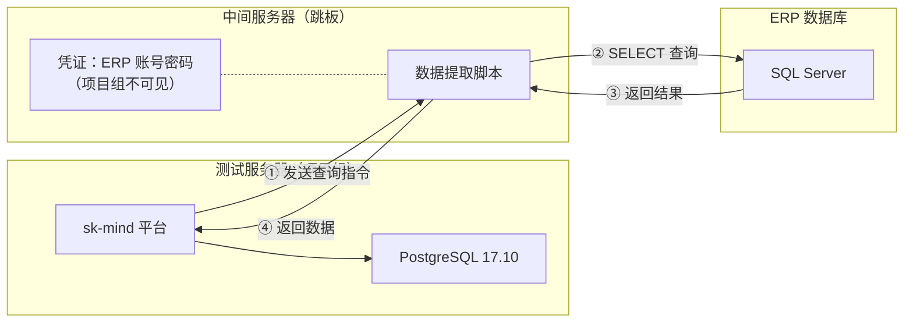
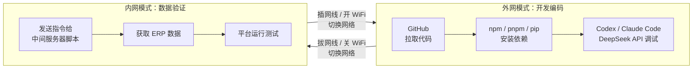

# sk-mind 数据平台——ERP 数据通道申请函

> **文档性质**：正式申请函
> **申请日期**：2026-07-15
> **收件人**：欧阳慧娟经理
> **申请人**：sk-mind 项目组

---

## 一、申请事由

因 **AI 原生企业数据平台（sk-mind）** 项目建设需要，现申请建立一条从测试服务器到 ERP 数据库的 **受控数据通道**，使平台能够在测试阶段接入真实 ERP 数据进行验证。

---

## 二、项目背景

sk-mind 是一个面向中小型制造企业的 AI 原生企业数据平台，目标是将企业内分散于 ERP、MES、采购、考勤、财务、仓储等业务系统的数据统一汇聚，形成可治理、可追踪、可语义理解的企业数据底座。

平台测试服务器当前环境（详见 [[测试主机开发环境总览]]）：

| 组件 | 状态 |
|---|---|
| 操作系统 | Windows（无法安装 Docker） |
| 平台数据库 | PostgreSQL 17.10（端口 5432） |
| ERP 测试库 | SQL Server Express 2025（空壳，无真实数据） |
| 运行环境 | Node.js 24 + Python 3.13 + Nginx 1.31，均已就绪 |

> **当前卡点**：测试服务器上的 ERP 数据库为空壳，缺少真实业务数据，无法验证数据接入、语义建模、Agent 查询等核心链路。

---

## 三、数据通道方案——中间服务器脚本 + 跳板模式

### 3.1 方案架构

> **核心原则**：数据库账号密码不由项目组持有，直接配置在中间服务器脚本上，项目组全程不接触凭证。

- **中间服务器**上部署一个数据提取脚本，ERP 数据库账号密码 **直接写入该脚本配置中**。
- 测试服务器通过内网向中间服务器脚本 **发送数据请求指令**（如指定表名、时间范围），脚本执行查询后将数据返回。
- **项目组不持有、不接触、不知晓 ERP 数据库账号密码**。凭证仅存在于中间服务器脚本上。

### 3.2 网络隔离方案

| 阶段   | 网络状态 | 内网有线  | WiFi 外网   | 用途                                                                                                             |
| ---- | ---- | ----- | --------- | -------------------------------------------------------------------------------------------------------------- |
| 开发编码 | 外网模式 | ❌ 拔网线 | ✅ 开启      | `git pull` 拉取代码 `npm install` / `pnpm install` / `pip install` AI 调试（Codex / Claude Code 接 DeepSeek API） |
| 数据验证 | 内网模式 | ✅ 插网线 | ❌ 关闭 WiFi | 通过中间服务器脚本获取 ERP 数据 平台运行和测试                                                                                  |
| 正式运行 | 仅内网  | ✅ 插网线 | ❌ 关闭 WiFi | 平台正式运行，不连公网                                                                                                    |

> **关键原则**：内网有线和 WiFi 绝不同时启用。获取数据时无法访问互联网，编码下载依赖时无法访问内网数据。

### 3.3 数据用途

通过中间服务器脚本获取的 ERP 数据仅用于以下场景：

| 序号 | 场景 | 说明 |
|---|---|---|
| 1 | 数据接入验证 | 验证真实 ERP 数据能否通过接入任务写入平台 Raw 层 |
| 2 | 数据分层测试 | 验证 Raw → Clean → Serving 分层链路在真实数据上的表现 |
| 3 | 数据目录构建 | 根据真实表结构和字段构建数据目录 |
| 4 | 语义建模验证 | 用真实业务数据验证 BusinessObject、属性、关系映射的准确性 |
| 5 | Agent 查询测试 | 验证 Agent 在真实数据上的受控查询和来源解释能力 |

### 3.4 脚本功能需求

中间服务器脚本建议实现以下基本功能：

- 接收来自测试服务器的查询请求（指定表/视图、字段、时间范围）。
- 使用内网凭证连接 ERP 数据库，执行 SELECT 查询。
- 将查询结果返回给测试服务器。
- **仅支持 SELECT 只读查询**，不执行任何写操作。

---

## 四、风险评估

### 4.1 已具备的安全措施

| 安全措施 | 说明 |
|---|---|
| 凭证不落地 | 数据库账号密码仅配置在中间服务器脚本上，项目组全程不接触 |
| 物理隔离 | 外网模式拔网线 + 关 WiFi；内网模式插网线 + 关 WiFi，双网卡不同时启用 |
| 只读查询 | 脚本仅执行 SELECT，不写入、不修改、不删除 |
| 权限管控 | 平台内部：用户 → 角色 → 数据集权限 → 敏感字段脱敏 |
| 审计日志 | 全链路审计：脚本查询记录、平台数据访问、Agent 工具调用 |
| 敏感字段脱敏 | 对敏感数据字段自动脱敏，前端展示与 Agent 查询同时生效 |
| 不写回 ERP | Agent 不自动写回 ERP 等核心业务系统 |
| 测试环境隔离 | 测试服务器与生产 ERP 通过中间服务器隔离，不直连 |

### 4.2 潜在风险与缓解措施

| 风险项 | 风险等级 | 缓解措施 |
|---|---|---|
| 脚本被篡改导致越权访问 | 中 | 脚本由李家国部署维护，测试服务器无法修改脚本 |
| 数据传输过程被截获 | 低 | 数据仅在局域网内传输，不经过公网 |
| 查询压力影响 ERP | 低 | 脚本可加入限频、超时保护 |
| 测试阶段外网泄露风险 | 低 | 物理隔离——内网有线与 WiFi 绝不同时启用 |
| 项目组间接获取数据后泄露 | 低 | 敏感字段脱敏、权限管控、审计日志可追踪 |

> **结论**：凭证不落项目组 + 网络物理隔离 + 只读查询 + 全链路审计，方案整体风险可控。项目组不持有账号密码是最大安全保障。

---

## 五、使用人员说明

### 5.1 测试服务器使用人员

| 姓名 | 角色 | 职责 |
|---|---|---|
| 黄春幸 | 开发人员 | 平台前后端开发、数据接入、语义建模、中间服务器脚本开发 |
| 刘国靖 | 开发人员 | 平台前后端开发、AI Agent 集成调试 |

> **说明**：以上人员 **不持有、不可见、不接触** ERP 数据库账号密码。仅通过平台代码向中间服务器脚本发送数据请求指令。

### 5.2 中间服务器脚本

| 姓名 | 角色 | 职责 |
|---|---|---|
| 黄春幸 | 脚本开发 | 开发中间服务器数据提取脚本 |
| 李家国 | 脚本部署维护 | 部署和维护脚本，配置 ERP 数据库凭证（项目组不可见） |

> **说明**：黄春幸负责编写脚本代码，李家国负责将脚本部署到中间服务器并将 ERP 凭证配置到脚本上。黄春幸开发脚本时不接触真实凭证，可使用测试凭证或占位符。

### 5.3 数据安全意识与保密协议

- 项目组全体成员（黄春幸、刘国靖）可签署企业保密协议。
- 通过脚本获取的 ERP 数据仅存储在测试服务器 PostgreSQL 中，不向外传输。
- 平台所有操作均有审计日志记录，行为可追溯。

---

## 六、申请内容汇总

| 申请项 | 具体要求 |
|---|---|
| 申请内容 | 在中间服务器上部署一个数据提取脚本，连接 ERP 数据库 |
| 数据库凭证 | 由李家国直接配置在脚本上，**不给项目组（黄春幸、刘国靖）** |
| 脚本开发 | 黄春幸 |
| 脚本部署维护 | 李家国 |
| 脚本权限 | 仅 SELECT 查询，不执行写操作 |
| 通信方式 | 测试服务器 → 中间服务器脚本（内网有线） |
| 网络要求 | 正式运行仅内网有线；开发阶段内网有线与 WiFi 互斥，不同时启用 |
| 测试服务器使用人员 | 黄春幸、刘国靖 |
| 使用场景 | 数据接入验证、数据分层测试、语义建模验证、Agent 查询测试 |
| 安全措施 | 凭证不落地、物理隔离、只读查询、敏感脱敏、全链路审计 |

---

## 七、申请评估请求

恳请欧阳慧娟经理评估并审批以下事项：

1. 是否同意在中间服务器上部署数据提取脚本，建立测试服务器到 ERP 的受控数据通道。
2. 是否同意数据库凭证由李家国直接配置在脚本上，不提供给项目组（黄春幸、刘国靖）。
3. 确认分工：黄春幸负责脚本开发，李家国负责脚本部署和凭证配置。
4. 确认测试服务器网络隔离方案（内网有线与 WiFi 互斥）可接受。
5. 确认项目组成员（黄春幸、刘国靖）保密协议覆盖范围是否充分。

如有任何安全合规方面的疑虑或补充要求，项目组将全力配合调整方案。

---

> **申请人（项目组）**：sk-mind 项目组
> **日期**：2026-07-15
